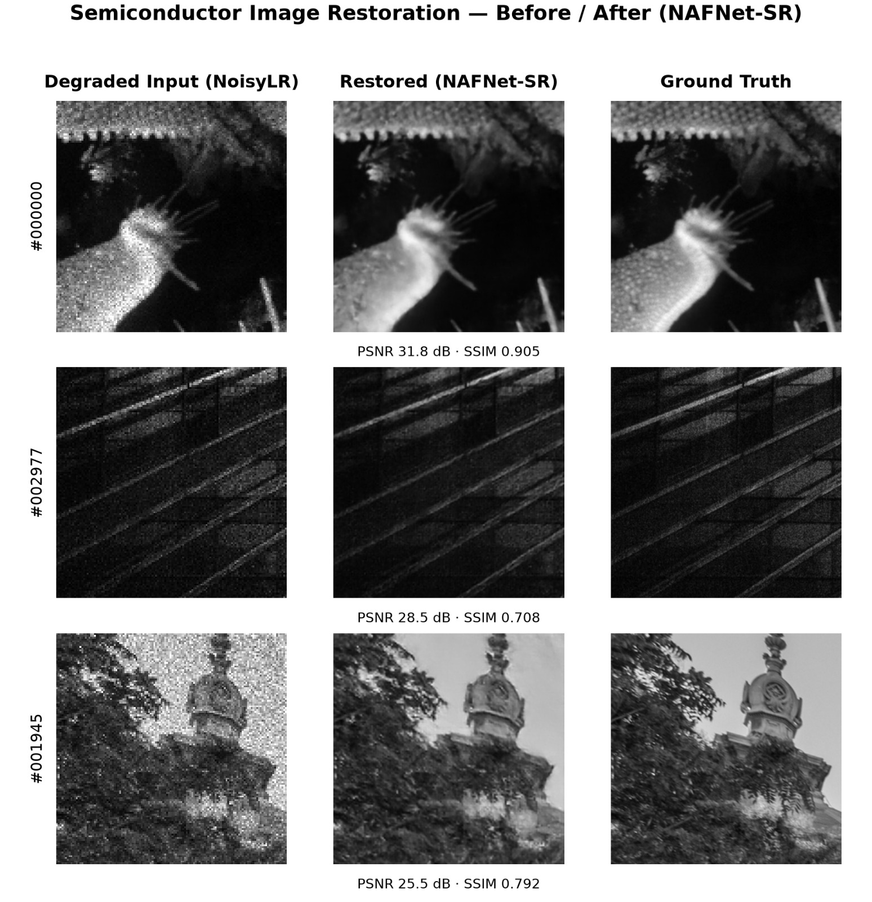

# AI-Based Restoration of Degraded Images for Semiconductor Inspection

Restores 128×128 speckle/Gaussian-noise-degraded, 2×-downsampled grayscale
inspection images back to clean 256×256 GT resolution, using a NAFNet-style
restoration network trained on a mix of real and synthetically-degraded pairs.

## Setup

```bash
python3 -m venv .venv
source .venv/bin/activate      # Windows: .venv\Scripts\activate
pip install -r requirements.txt
```

If your Python environment is externally managed (e.g. a system Python on
Debian/macOS Homebrew), use:

```bash
pip install -r requirements.txt --break-system-packages
```

## Data layout

```
train/GT/<id>.npy        float32, (256, 256), range [0, 1]      — ground truth
train/NoisyLR/<id>.npy   float32, (128, 128), range NOT clipped — paired degraded/LR input
NoisyLR/<id>.npy         float32, (128, 128), range NOT clipped — hidden-test inputs, no GT
```

`train/GT` and `train/NoisyLR` contain 3200 paired images (same IDs in both).
The root-level `NoisyLR/` (400 files) has no paired GT — it is the held-out
evaluation set. Train/val splitting is done by image ID (see
`src/data/dataset.py:split_ids`), never per-crop, so no image contributes to
both splits.

## Reproduce training

```bash
# comparison baseline (lightweight U-Net, bicubic upsample + residual denoise)
python train_baseline.py --config configs/base.yaml

# main model (NAFNet-SR: NAFNet encoder/bottleneck/decoder + sub-pixel upsample head)
python train.py --config configs/base.yaml
```

Every hyperparameter (data paths, image size, batch size, LR, epochs,
degradation ranges, loss weights) lives in `configs/base.yaml` — see
`configs/README.md` for a field-by-field description. `train.py` snapshots
the exact resolved config for each run to `configs/run_<timestamp>.yaml` for
reproducibility, and logs the fixed random seed at startup.

Checkpoints are written to `weights/nafnet_sr_epoch{N}.pth` (periodic) and
`weights/nafnet_sr_best.pth` (best validation PSNR+SSIM). TensorBoard logs
land in `runs/<run_name>/`:

```bash
tensorboard --logdir runs/
```

## Run inference

```bash
python inference.py --input_dir NoisyLR --output_dir results/restored \
    --checkpoint weights/nafnet_sr_best.pth
```

**Input/output contract:**
- Accepts `.npy` (float32 grayscale arrays — the format used by this
  dataset) and common raster formats (`.png/.jpg/.jpeg/.tif/.tiff/.bmp`,
  read/written as 8-bit grayscale).
- Output filenames and format exactly match the input filenames.
- Output values are explicitly clipped to `[0, 1]` (and rescaled to
  `[0, 255]` uint8 for raster formats) before saving. The raw NoisyLR data is
  **not** clipped (noise pushes it outside `[0, 1]`), and downstream
  evaluation does not clip either — this script performs the clip itself so
  the saved images are always valid image data.
- Runs FP16 by default (`--fp32` to disable), batched (`--batch_size`,
  default 8), and supports `--device cuda|mps|cpu` with automatic fallback if
  the requested device is unavailable.
- Prints per-batch and total end-to-end timing (I/O + preprocess + forward +
  postprocess) to stdout.

## Assumptions

- **Degradation order is not disclosed by the dataset**, only the paired
  input/output. `src/data/degradations.py`'s `RandomDegradationPipeline`
  assumes speckle noise, Gaussian noise, and downsampling are applied in a
  **random order** with randomly sampled severity per image (BSRGAN/
  Real-ESRGAN-style shuffle), rather than one fixed recipe — this was chosen
  after visually comparing synthetic vs. real NoisyLR samples
  (`results/samples/degradation_preview.png`) and finding it a reasonable
  match, not derived from any disclosed ground truth about KLA's pipeline.
- **Hidden test format**: the root-level `NoisyLR/` directory is assumed to
  represent the hidden test distribution (same `.npy`, 128×128, unclipped
  float32 format as the paired training NoisyLR). `inference.py` is built to
  run against exactly that directory structure with no code changes.
- **Training and benchmarking were run on an NVIDIA GeForce RTX 3050 Laptop
  GPU.** All scripts default to `cuda` per the spec but fall back
  automatically to `mps` then `cpu` (`src/device.py`) for development on
  Apple Silicon / CPU-only machines. See `results/RESULTS.md` for the
  measured throughput, including the (counterintuitive on this particular
  GPU) FP32-vs-FP16 comparison.

## Sample Results

Navigate to [RESULTS.md](results/RESULTS.md) to get insights into comparison, throughput benchmarks, and qualitative/failure-case analysis.

